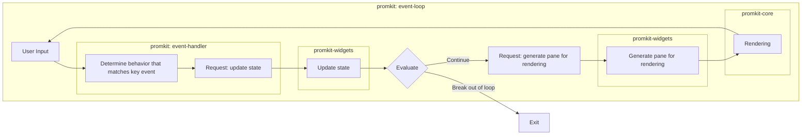

# Concept

## Well-defined boundaries for responsibilities and modularization

The core design principle of promkit is the clear separation of the following three functions,
each implemented in dedicated modules:

- **Event Handlers**: Define behaviors for keyboard inputs (such as when <kbd>Enter</kbd> is pressed)
  - **promkit**: Responsible for implementing event handlers, combining widgets and handling corresponding events
  - In the future, there is potential to further separate event handlers to improve customizability.

- **State Updates**: Managing and updating the internal state of widgets
  - **promkit-widgets**: Responsible for state management of various widgets and pane generation
  - Each widget implements
  [PaneFactory](https://docs.rs/promkit-core/0.1.1/promkit_core/trait.PaneFactory.html)
  trait to generate panes needed for rendering

> [!IMPORTANT]
> The widgets themselves DO NOT contain event handlers
> - This prevents key operation conflicts
> when combining multiple widgets
> - e.g. When combining a listbox and text editor, <kbd>↓</kbd>
> behavior could potentially conflict
>   - navigating the list vs. recalling input history

- **Rendering**: Processing to visually display the generated panes
  - **promkit-core**: Responsible for basic terminal operations
  - [Terminal](https://docs.rs/promkit_core/0.1.1/terminal/struct.Terminal.html) handles rendering
    - Currently uses full rendering with plans to implement differential rendering in the future.
  - [Pane](https://docs.rs/promkit_core/0.1.1/pane/struct.Pane.html)
  defines the data structures for rendering

This separation allows each component to focus on a single responsibility,
making customization and extension easier.

### Event-Loop

These three functions collectively form the core of "event-loop" logic.
Here is the important part of the actual event-loop from
[Prompt<T: Renderer>::run](https://docs.rs/promkit/0.9.1/promkit/struct.Prompt.html#method.run):

```rust
// Core part of event-loop
loop {
    // Read events
    let ev = event::read()?;

    // Evaluate events and update state
    if self.renderer.evaluate(&ev)? == PromptSignal::Quit {
        // Exit processing
        break;
    }

    // Render based on the latest state
    let size = crossterm::terminal::size()?;
    terminal.draw(&self.renderer.create_panes(size.0, size.1))?;
}
```

As a diagram:



In the current implementation of promkit, event handling is centralized.
That is, all events are processed sequentially within
[Prompt<T: Renderer>::run](https://docs.rs/promkit/0.9.1/promkit/struct.Prompt.html#method.run)
and propagated to each widget through
[Renderer.evaluate](https://docs.rs/promkit/0.9.1/promkit/trait.Renderer.html#tymethod.evaluate).

> [!NOTE]
> The current implementation of
> [Prompt<T: Renderer>::run](https://docs.rs/promkit/0.9.1/promkit/struct.Prompt.html#method.run)
> is provisional. In the future,
> we plan to introduce more flexible event processing and rendering mechanisms.

## Customizability

promkit allows customization at various levels.
You can choose the appropriate customization method
according to your use case.

### Customize as configures

Using high-level APIs, you can easily customize existing preset components. For example, in
[preset::readline::Readline](https://github.com/ynqa/promkit/blob/v0.9.1/promkit/src/preset/readline.rs),
the following customizations are possible:

```rust
let mut p = Readline::default()
    // Set title text
    .title("Custom Title")
    // Change input prefix
    .prefix("$ ")
    // Prefix style
    .prefix_style(ContentStyle {
        foreground_color: Some(Color::DarkRed),
        ..Default::default()
    })
    // Active character style
    .active_char_style(ContentStyle {
        background_color: Some(Color::DarkCyan),
        ..Default::default()
    })
    // Inactive character style
    .inactive_char_style(ContentStyle::default())
    // Enable suggestion feature
    .enable_suggest(Suggest::from_iter(["option1", "option2"]))
    // Enable history feature
    .enable_history()
    // Input masking (for password input, etc.)
    .mask('*')
    // Set word break characters
    .word_break_chars(HashSet::from([' ', '-']))
    // Input validation feature
    .validator(
        |text| text.len() > 3,
        |text| format!("Please enter more than 3 characters (current: {} characters)", text.len()),
    )
    // Register custom keymap
    .register_keymap("custom", my_custom_keymap)
    .prompt()?;
```

By combining these configuration options, you can significantly customize existing presets.

### Advanced Customization

Lower-level customization is also possible:

1. **Creating custom widgets**: You can create your own widgets equivalent to `promkit-widgets`. 
By implementing
[PaneFactory](https://docs.rs/promkit-core/0.1.1/promkit_core/trait.PaneFactory.html)
trait for your data structure, you can use it like other standard widgets.
e.g. https://github.com/ynqa/empiriqa/blob/v0.1.0/src/queue.rs

2. **Defining custom presets**: By combining multiple widgets and implementing your own event handlers, 
you can create completely customized presets. In that case, you need to implement
[Renderer](https://docs.rs/promkit/0.9.1/promkit/trait.Renderer.html) trait.

This allows you to leave event-loop logic to promkit (i.e., you can execute
[Prompt<T: Renderer>::run](https://docs.rs/promkit/0.9.1/promkit/struct.Prompt.html#method.run))
while implementing your own rendering logic and event handling.

3. **Customizing Event-Loop**: One of the important features of promkit is the clear separation
between widgets (UI elements) and renderer (rendering logic). This separation allows users to flexibly
control how the two interact.

For example, [jnv](https://github.com/ynqa/jnv) project implements its own Renderer to allow 
widgets to directly control rendering (excerpt below):

```rust
// Implementation example in jnv
pub struct Renderer {
    terminal: Terminal,
    panes: [Pane; PANE_SIZE],
}

impl Renderer {
    pub fn update_and_draw<I: IntoIterator<Item = (PaneIndex, Pane)>>(
        &mut self,
        iter: I,
    ) -> anyhow::Result<()> {
        for (index, pane) in iter {
            self.panes[index as usize] = pane;
        }
        self.terminal.draw(&self.panes)?;
        Ok(())
    }
}
```

With this approach, widgets can hold an instance of `Renderer` directly and actively request 
rendering by calling `update_and_draw` method when their state is updated.

In the future, we plan to extend promkit to allow users to more intuitively and flexibly compose 
their own event-loop logic. This will make it easier to customize according to the characteristics 
and requirements of each application, aiming to accommodate a wider range of use cases.
