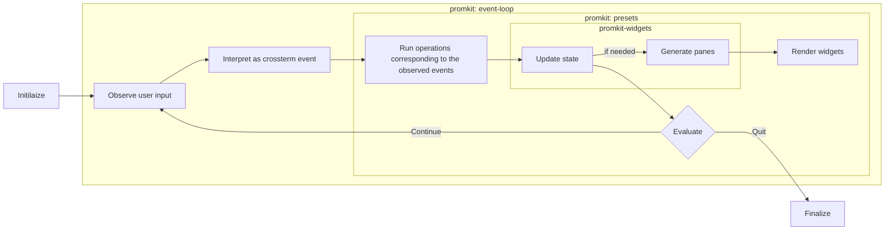

# Concept

## Well-defined boundaries for responsibilities and modularization

The core design principle of promkit is the clear separation of the following three functions,
each implemented in dedicated modules:

- **Event Handlers**: Define behaviors for keyboard inputs (such as when <kbd>Enter</kbd> is pressed)
  - **promkit**: Responsible for implementing [Prompt](https://docs.rs/promkit/0.10.0/promkit/trait.Prompt.html) trait, combining widgets and handling corresponding events
  - The new async `Prompt` trait provides `initialize`, `evaluate`, and `finalize` methods for complete lifecycle management
  - Event processing is now handled through a singleton `EventStream` for asynchronous event handling

- **State Updates**: Managing and updating the internal state of widgets
  - **promkit-widgets**: Responsible for state management of various widgets and pane generation
  - Each widget implements
  [PaneFactory](https://docs.rs/promkit-core/0.1.1/promkit_core/trait.PaneFactory.html)
  trait to generate panes needed for rendering

> [!IMPORTANT]
> The widgets themselves DO NOT contain event handlers
> - This prevents key operation conflicts
> when combining multiple widgets
> - e.g. When combining a listbox and text editor, <kbd>↓</kbd>
> behavior could potentially conflict
>   - navigating the list vs. recalling input history

- **Rendering**: Processing to visually display the generated panes
  - **promkit-core**: Responsible for basic terminal operations and concurrent rendering
  - [SharedRenderer](https://docs.rs/promkit-core/0.2.0/promkit_core/render/type.SharedRenderer.html) (`Arc<Renderer<K>>`) provides thread-safe rendering with `SkipMap` for efficient pane management
  - Components now actively trigger rendering (Push-based) rather than being rendered by the event loop
  - [Terminal](https://docs.rs/promkit_core/0.1.1/terminal/struct.Terminal.html) handles rendering with `Mutex` for concurrent access
    - Currently uses full rendering with plans to implement differential rendering in the future.
  - [Pane](https://docs.rs/promkit_core/0.1.1/pane/struct.Pane.html)
  defines the data structures for rendering

This separation allows each component to focus on a single responsibility,
making customization and extension easier.

### Event-Loop

These three functions collectively form the core of "event-loop" logic.
Here is the important part of the actual event-loop from the new async
[Prompt::run](https://docs.rs/promkit/0.10.0/promkit/trait.Prompt.html#method.run):

```rust
// Core part of event-loop (v0.10.0 - async implementation)
self.initialize().await?;

while let Some(event) = EVENT_STREAM.lock().await.next().await {
    match event {
        Ok(event) => {
            // Evaluate the event and update state
            if self.evaluate(&event).await? == Signal::Quit {
                break;
            }
        }
        Err(e) => {
            eprintln!("Error reading event: {}", e);
            break;
        }
    }
}

self.finalize()
```

As a diagram:



In the current implementation of promkit (v0.10.0), event handling is centralized and async.
All events are processed sequentially within the async
[Prompt::run](https://docs.rs/promkit/0.10.0/promkit/trait.Prompt.html#method.run)
method and propagated to each implementation through the
[Prompt::evaluate](https://docs.rs/promkit/0.10.0/promkit/trait.Prompt.html#tymethod.evaluate) method.

> [!NOTE]
> The v0.10.0 implementation introduces significant improvements:
> - **Async support**: Full async/await pattern for better performance and responsiveness
> - **Singleton EventStream**: Prevents cursor position reading errors and improves reliability
> - **SharedRenderer**: Thread-safe rendering with `Arc<Renderer<K>>` and `SkipMap` for efficient pane management
> - **Lifecycle management**: Clear `initialize`, `evaluate`, and `finalize` phases

## Customizability

promkit allows customization at various levels.
You can choose the appropriate customization method
according to your use case.

### Customize as configures

Using high-level APIs, you can easily customize existing preset components. For example, in
[preset::readline::Readline](https://github.com/ynqa/promkit/blob/v0.9.1/promkit/src/preset/readline.rs),
the following customizations are possible:

```rust
let mut p = Readline::default()
    // Set title text
    .title("Custom Title")
    // Change input prefix
    .prefix("$ ")
    // Prefix style
    .prefix_style(ContentStyle {
        foreground_color: Some(Color::DarkRed),
        ..Default::default()
    })
    // Active character style
    .active_char_style(ContentStyle {
        background_color: Some(Color::DarkCyan),
        ..Default::default()
    })
    // Inactive character style
    .inactive_char_style(ContentStyle::default())
    // Enable suggestion feature
    .enable_suggest(Suggest::from_iter(["option1", "option2"]))
    // Enable history feature
    .enable_history()
    // Input masking (for password input, etc.)
    .mask('*')
    // Set word break characters
    .word_break_chars(HashSet::from([' ', '-']))
    // Input validation feature
    .validator(
        |text| text.len() > 3,
        |text| format!("Please enter more than 3 characters (current: {} characters)", text.len()),
    )
    // Register custom keymap
    .register_keymap("custom", my_custom_keymap)
    .prompt()?;
```

By combining these configuration options, you can significantly customize existing presets.

### Advanced Customization

Lower-level customization is also possible:

1. **Creating custom widgets**: You can create your own widgets equivalent to `promkit-widgets`. 
By implementing
[PaneFactory](https://docs.rs/promkit-core/0.1.1/promkit_core/trait.PaneFactory.html)
trait for your data structure, you can use it like other standard widgets.
e.g. https://github.com/ynqa/empiriqa/blob/v0.1.0/src/queue.rs

2. **Defining custom presets**: By combining multiple widgets and implementing your own event handlers, 
you can create completely customized presets. In that case, you need to implement the async
[Prompt](https://docs.rs/promkit/0.10.0/promkit/trait.Prompt.html) trait.

This allows you to leave event-loop logic to promkit (i.e., you can execute the async
[Prompt::run](https://docs.rs/promkit/0.10.0/promkit/trait.Prompt.html#method.run))
while implementing your own rendering logic and event handling with full async support.

```rust
// Example of implementing the new Prompt trait
#[async_trait::async_trait]
impl Prompt for MyCustomPrompt {
    type Index = MyIndex;
    type Return = MyResult;

    fn renderer(&self) -> SharedRenderer<Self::Index> {
        self.renderer.clone()
    }

    async fn initialize(&mut self) -> anyhow::Result<()> {
        // Initialize your prompt state
        self.renderer.render().await
    }

    async fn evaluate(&mut self, event: &Event) -> anyhow::Result<Signal> {
        // Handle events and update state
        match event {
            // Your event handling logic
            _ => Ok(Signal::Continue),
        }
    }

    fn finalize(&mut self) -> anyhow::Result<Self::Return> {
        // Produce final result
        Ok(self.result.clone())
    }
}
```
