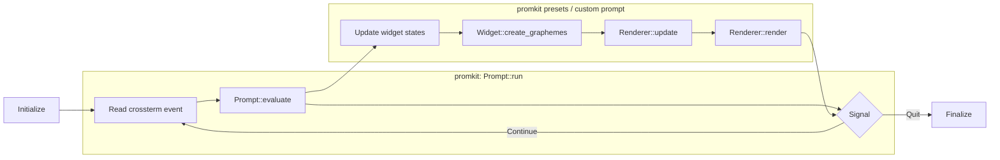

# Concept

## Responsibility Boundaries and Data Flow

promkit is organized around three responsibilities with clear boundaries:

1. **Event orchestration (`promkit`)**
   - [`Prompt`](./promkit/src/lib.rs) defines lifecycle hooks:
     `initialize -> evaluate -> finalize`
   - [`Prompt::run`](./promkit/src/lib.rs) manages terminal setup/teardown
     (raw mode, cursor visibility) and drives input events from a singleton
     `EVENT_STREAM`.
   - Events are processed sequentially.

2. **State management and UI materialization (`promkit-widgets` + `promkit-core`)**
   - Each widget state implements [`Widget`](./promkit-core/src/lib.rs).
   - `Widget::create_graphemes(width, height)` returns
     [`StyledGraphemes`](./promkit-core/src/grapheme.rs), which is the render-ready
     text unit including style and line breaks.
   - Widget states focus on state and projection only.

> [!IMPORTANT]
> Widgets intentionally do not own event-loop policies.
> Event handling stays in presets or custom `Prompt` implementations,
> which avoids key-binding conflicts when multiple widgets are combined.

3. **Rendering (`promkit-core`)**
   - [`Renderer<K>`](./promkit-core/src/render.rs) stores ordered grapheme chunks in
     `SkipMap<K, StyledGraphemes>`.
   - `update` / `remove` modify chunks by index key.
   - `render` delegates drawing to [`Terminal`](./promkit-core/src/terminal.rs).
   - `Terminal::draw` performs wrapping, clearing, printing, and scrolling.

This keeps responsibilities explicit:
- prompt = control flow
- widgets = state to graphemes
- core renderer = terminal output

## Event Loop

Current core loop in [`Prompt::run`](./promkit/src/lib.rs):

```rust
self.initialize().await?;

while let Some(event) = EVENT_STREAM.lock().await.next().await {
    match event {
        Ok(event) => {
            // Current behavior: skip resize events in run loop.
            if event.is_resize() {
                continue;
            }

            if self.evaluate(&event).await? == Signal::Quit {
                break;
            }
        }
        Err(_) => break,
    }
}

self.finalize()
```

As a diagram:


```mermaid
flowchart LR
    Init[Initialize] --> Observe

    subgraph Runtime["promkit: Prompt::run"]
        Observe[Read crossterm event] --> Eval[Prompt::evaluate]
        Eval --> Continue{Signal}
        Continue -->|Continue| Observe
    end

    subgraph Preset["promkit presets / custom prompt"]
        Eval --> UpdateState[Update widget states]
        UpdateState --> Build[Widget::create_graphemes]
        Build --> Push[Renderer::update]
        Push --> Draw[Renderer::render]
    end

    Draw --> Continue
    Continue -->|Quit| Finalize[Finalize]
```

## Customizability

promkit supports customization at two levels.

### 1. Configure existing presets

High-level presets (e.g. `Readline`) expose builder-style options such as:

- title and style
- prefix and cursor styles
- suggestion and history
- masking
- word-break characters
- validator
- text editor visible line count
- evaluator override

```rust
use std::collections::HashSet;

use promkit::{
    Prompt,
    core::crossterm::style::{Color, ContentStyle},
    preset::readline::Readline,
    suggest::Suggest,
};

#[tokio::main]
async fn main() -> anyhow::Result<()> {
    let result = Readline::default()
        .title("Custom Title")
        .prefix("$ ")
        .prefix_style(ContentStyle {
            foreground_color: Some(Color::DarkRed),
            ..Default::default()
        })
        .active_char_style(ContentStyle {
            background_color: Some(Color::DarkCyan),
            ..Default::default()
        })
        .inactive_char_style(ContentStyle::default())
        .enable_suggest(Suggest::from_iter(["option1", "option2"]))
        .enable_history()
        .mask('*')
        .word_break_chars(HashSet::from([' ', '-']))
        .text_editor_lines(3)
        .validator(
            |text| text.len() > 3,
            |text| format!("Please enter more than 3 characters (current: {})", text.len()),
        )
        .run()
        .await?;

    println!("result: {result}");
    Ok(())
}
```

### 2. Build your own prompt

For advanced use cases, combine your own state + evaluator + renderer.

- Implement `Widget` for custom state projection
- Implement `Prompt` for lifecycle and event handling
- Use `Renderer::update(...).render().await` whenever UI should change

This is the same pattern used in [`examples/byop`](./examples/byop/src/byop.rs),
including async background updates (e.g. spinner/task monitor) that push
grapheme updates directly to the shared renderer.

## Quality Strategy for Rendering Behavior

Ensuring consistent rendering behavior across terminal environments is a key focus.
To achieve this, promkit includes a suite of test tools:

- [`termharness`](./termharness)
- [`zsherio`](./zsherio)
- [`zsh-render-parity`](./zsh-render-parity)

These tools compare prompt behavior against zsh-oriented scenarios
(e.g. wrapping, resize, and cursor movement), helping keep terminal behavior
predictable while the rendering internals evolve.
