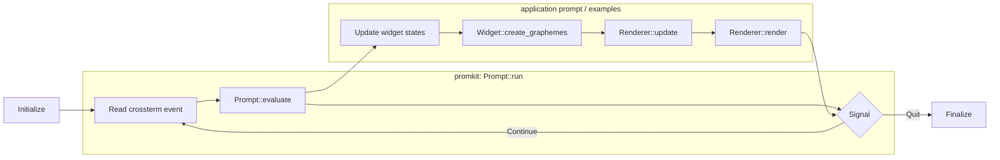

# Concept

## Responsibility Boundaries and Data Flow

promkit is organized around four responsibilities with clear boundaries:

1. **Prompt lifecycle runtime (`promkit`)**
   - [`Prompt`](./promkit/src/runtime.rs) defines lifecycle hooks:
     `initialize -> evaluate -> finalize`
   - [`Prompt::run`](./promkit/src/runtime.rs) manages terminal setup/teardown
     (raw mode, cursor visibility) and drives input events from a singleton
     `EVENT_STREAM`.
   - Events are processed sequentially.

2. **Application event policy (`examples` and downstream applications)**
   - Applications implement `Prompt` by combining the widget states they need.
   - Key bindings, focus transitions, validation flow, and quit conditions stay
     in the application.
   - The examples are reference compositions, not APIs exported by `promkit`.

3. **State management and UI materialization (`promkit-widgets`)**
   - Each widget state implements [`Widget`](./promkit-core/src/lib.rs).
   - `Widget::create_graphemes()` returns `CreatedGraphemes`: width-independent
     styled content, layout hints, and an optional logical cursor position.
   - Large widgets can override `create_graphemes_in_viewport(width, height)` to
     project only content that can be displayed. Prompts that use this path
     obtain the current terminal size before updating the renderer.
   - Widget states focus on state and projection only.

> [!IMPORTANT]
> Widgets intentionally do not own event-loop policies.
> Event handling stays in application `Prompt` implementations,
> which avoids key-binding conflicts when multiple widgets are combined.

4. **Rendering (`promkit-core`)**
   - [`Renderer<K>`](./promkit-core/src/render.rs) stores ordered
     `CreatedGraphemes` chunks.
   - [`RendererLayout<K>`](./promkit-core/src/render/layout.rs) performs
     terminal-size-dependent wrapping, pane allocation, cursor scrolling, and
     viewport clipping without terminal I/O.
   - `update` / `remove` modify chunks by index key.
   - `render` wraps or truncates content, assigns vertical viewports, scrolls
     viewports to include logical cursors, and saves a keyed layout snapshot.
   - The layout snapshot supports screen-to-widget hit testing and the inverse
     widget-to-screen position mapping.
   - `render` delegates drawing to [`Terminal`](./promkit-core/src/terminal.rs).
   - `Terminal::draw_rows` performs clearing, printing, and terminal scrolling
     after layout is complete.

This keeps responsibilities explicit:
- runtime = lifecycle and terminal event stream
- application prompt = event and focus policy
- widgets = state to graphemes
- core renderer = terminal output

## Event Loop

Current core loop in [`Prompt::run`](./promkit/src/runtime.rs):

```rust
self.initialize().await?;

while let Some(event) = EVENT_STREAM.lock().await.next().await {
    match event {
        Ok(event) => {
            // Current behavior: skip resize events in run loop.
            if event.is_resize() {
                continue;
            }

            if self.evaluate(&event).await? == Signal::Quit {
                break;
            }
        }
        Err(_) => break,
    }
}

self.finalize()
```

As a diagram:


```mermaid
flowchart LR
    Init[Initialize] --> Observe

    subgraph Runtime["promkit: Prompt::run"]
        Observe[Read crossterm event] --> Eval[Prompt::evaluate]
        Eval --> Continue{Signal}
        Continue -->|Continue| Observe
    end

    subgraph Application["application prompt / examples"]
        Eval --> UpdateState[Update widget states]
        UpdateState --> Build[Widget::create_graphemes]
        Build --> Push[Renderer::update]
        Push --> Draw[Renderer::render]
    end

    Draw --> Continue
    Continue -->|Quit| Finalize[Finalize]
```

## Customizability

Applications select the capabilities and widgets they need through Cargo
features. The runtime is independent from the widget set:

```toml
promkit = { version = "0.14.0", features = [
  "runtime",
  "validate",
  "prefixsearch",
  "text",
  "texteditor",
] }
```

The application then combines its own state, event policy, and renderer:

- Use the widget states required by the application
- Implement `Prompt` for lifecycle and event handling
- Use `Renderer::update(...).render().await` whenever UI should change

The examples are the reference implementations for these compositions.
[`examples/readline`](./examples/readline/) combines text, text-editor, and
prefix-search widgets with validation. `PrefixSearch` retains its radix trie,
active query, and selection as widget state and projects matching candidates
directly without repackaging them into a listbox.
[`examples/async_task`](./examples/async_task/) demonstrates background updates
that push grapheme changes directly to a shared renderer.

## Quality Strategy for Rendering Behavior

Ensuring consistent rendering behavior across terminal environments is a key focus.
The [readline terminal scenarios](./tests/readline/tests/scenarios) use
[`termharness`](https://github.com/ynqa/termharness) to verify wrapping, resizing,
cursor movement, and viewport behavior against recorded screen expectations.
This keeps terminal behavior predictable while the rendering internals evolve.
