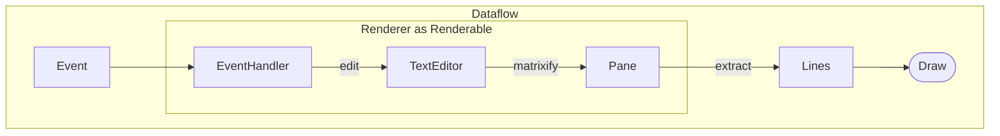

# promkit

[](https://github.com/ynqa/promkit/actions/workflows/promkit.yml)
[](https://docs.rs/promkit)

A toolkit for building your own interactive prompt in Rust.

## Getting Started

Put the package in your `Cargo.toml`.

```toml
[dependencies]
promkit = "0.3.0"
```

## Features

- Support cross-platform both UNIX and Windows owing to [crossterm](https://github.com/crossterm-rs/crossterm)
- Various building methods
  - Preset; Support for quickly setting up a UI by providing simple parameters.
    - [Readline](#readline)
    - [Confirm](#confirm)
    - [Password](#password)
    - [Select](#select)
    - [QuerySelect](#queryselect)
    - [Checkbox](#checkbox)
    - [Tree](#tree)
  - Combining various UI components.
    - They are provided with the same interface, allowing users to choose and
      assemble them according to their preferences.
  - (Upcoming) Stronger support to display yor own data structures.
- Versatile customization capabilities
  - Theme for designing the appearance of the prompt.
    - e.g. cursor, text
  - Validation for user input and error message construction.

## Examples

*promkit* provides presets so that users can try prompts immediately without
having to build complex components for specific use cases.  

### Readline

<details>
<summary>Command</summary>

```bash
cargo run --example readline
```

</details>

<details>
<summary>Code</summary>

```rust
use promkit::{error::Result, preset::Readline};

fn main() -> Result {
    let mut p = Readline::default().title("Feel free to fill in").prompt()?;
    println!("result: {:?}", p.run()?);
    Ok(())
}
```
</details>


### Confirm

<details>
<summary>Command</summary>

```bash
cargo run --example confirm
```

</details>

<details>
<summary>Code</summary>

```rust
use promkit::{error::Result, preset::Confirm};

fn main() -> Result {
    let mut p = Confirm::new("Do you like programming?").prompt()?;
    println!("result: {:?}", p.run()?);
    Ok(())
}
```
</details>


### Password

<details>
<summary>Command</summary>

```bash
cargo run --example password
```

</details>

<details>
<summary>Code</summary>

```rust
use promkit::{error::Result, preset::Password};

fn main() -> Result {
    let mut p = Password::default()
        .title("Put your password")
        .validator(
            |text| 4 < text.len() && text.len() < 10,
            |text| format!("Length must be over 4 and within 10 but got {}", text.len()),
        )
        .prompt()?;
    println!("result: {:?}", p.run()?);
    Ok(())
}
```
</details>


### Select

<details>
<summary>Command</summary>

```bash
cargo run --example select
```
</details>

<details>
<summary>Code</summary>

```rust
use promkit::{error::Result, preset::Select};

fn main() -> Result {
    let mut p = Select::new(0..100)
        .title("What number do you like?")
        .screen_lines(5)
        .prompt()?;
    println!("result: {:?}", p.run()?);
    Ok(())
}
```
</details>


### QuerySelect

<details>
<summary>Command</summary>

```bash
cargo run --example queryselect
```
</details>

<details>
<summary>Code</summary>

```rust
use promkit::{error::Result, preset::QuerySelect};

fn main() -> Result {
    let mut p = QuerySelect::new(0..100, |text, items| -> Vec<String> {
        text.parse::<usize>()
            .map(|query| {
                items
                    .iter()
                    .filter(|num| query <= num.parse::<usize>().unwrap_or_default())
                    .map(|num| num.to_string())
                    .collect::<Vec<String>>()
            })
            .unwrap_or(items.clone())
    })
    .title("What number do you like?")
    .screen_lines(5)
    .prompt()?;
    println!("result: {:?}", p.run()?);
    Ok(())
}
```
</details>


### Checkbox

<details>
<summary>Command</summary>

```bash
cargo run --example checkbox
```
</details>

<details>
<summary>Code</summary>

```rust
use promkit::{error::Result, preset::Checkbox};

fn main() -> Result {
    let mut p = Checkbox::new(0..100)
        .title("What number do you like?")
        .screen_lines(5)
        .prompt()?;
    println!("result: {:?}", p.run()?);
    Ok(())
}
```
</details>

TBD

### Tree

<details>
<summary>Command</summary>

```bash
cargo run --example tree
```
</details>

<details>
<summary>Code</summary>

```rust
use promkit::{error::Result, preset::Tree, tree::Node};

fn main() -> Result {
    let mut p = Tree::new(Node::new("/").add_children([
        Node::new("foo").add_children([Node::new("test1.txt"), Node::new("test2.txt")]),
        Node::new("bar"),
        Node::new("baz"),
    ]))
    .title("Select a directory or file")
    .screen_lines(10)
    .prompt()?;
    println!("result: {:?}", p.run()?);
    Ok(())
}
```
</details>

TBD

## Why *promkit*?

Similar libraries in this category include the following:
- [console-rs/dialoguer](https://github.com/console-rs/dialoguer)
- [mikaelmello/inquire](https://github.com/mikaelmello/inquire/tree/main/inquire)

*promkit* offers several advantages over these libraries:

### Resilience to terminal resizing

Performing operations that involve executing a command in one pane while
simultaneously opening a new pane is a common occurrence. During such operations,
if UI corruption is caused by resizing the terminal size, it may adversely affect
the user experience.  
Other libraries can struggle when the terminal is resized, making typing and
interaction difficult or impossible. For example:

 - [(console-rs/dialoguer) Automatic re-render on terminal window resize](https://github.com/console-rs/dialoguer/issues/178)

*promkit* processes the data to fit the screen size, reducing the likelihood of
rendering issues, such as misalignment. This approach ensures that UI elements
remain consistent even when the terminal is resized, providing a smoother user
experience.

### Unified component approach

*promkit* takes a unified approach by having all of its components inherit the
same `Renderable` trait. This design choice enables users to seamlessly support
their custom data structures for display, similar to the relationships seen in
TUI projects like [ratatui-org/ratatui](https://github.com/ratatui-org/ratatui)
and
[EdJoPaTo/tui-rs-tree-widget](https://github.com/EdJoPaTo/tui-rs-tree-widget).
In other words, it's straightforward for anyone to display their own data
structures using widgets within promkit.  
In contrast, other libraries tend to treat each prompt as a mostly independent
entity. If you want to display a new data structure, you often have to build the
UI from scratch, which can be a time-consuming and less flexible process.

  ```rust
  pub trait Renderable {
      fn make_pane(&self, width: u16) -> Pane;
      fn handle_event(&mut self, event: &Event);
      fn postrun(&mut self);
  }
  ```

In the provided presets of *promkit*, this mechanism is implemented. If you'd
like to try it out, you can refer to
the implementations of
[view](https://github.com/ynqa/promkit/tree/v0.2.0/src/view)
and
[preset](https://github.com/ynqa/promkit/tree/v0.2.0/src/preset)
for guidance.

In summary, *promkit*'s resilience to terminal resizing and its unified component
approach make it a compelling choice for interactive command-line applications,
especially when compared to
[console-rs/dialoguer](https://github.com/console-rs/dialoguer) and
[mikaelmello/inquire](https://github.com/mikaelmello/inquire/tree/main/inquire).
These features provide a more reliable and extensible experience for developers,
allowing them to focus on building powerful command-line interfaces.

## Understanding dataflow and component interactions

### Dataflow from receiving events to rendering

This diagram shows the data flow for `Renderer` component.



When an event comes in, it is handled by the handler inside the `Renderer`
component. The handler then edits (e.g. insert character) `Text`.
This `TextEditor` is used to construct a `Pane`, which is essentially a matrix of
lines divided by a specific width. The panes are extracted a certain number of
lines in order to fit within the terminal screen when rendering.
Finally, these Lines are passed to a `draw` function which renders them on the screen.

### Relationship between TextEditor, Renderer, and Readline

A preset is composed of a combination of multiple components.
Let's take the Readline preset as an example to explain.

- Readline (preset)
  - Readline is a high-level preset component designed for text input.
    It provides a convenient interface for soliciting and managing user text
    input, error message presentation, and validation.
    Readline leverages the capabilities of Renderer and State\<Renderer\> for
    text editing and state management.
- TextEditor
  - TextEditor is a low-level component responsible for managing text content.
    It handles tasks related to storing, editing, and tracking the cursor
    position of text data.
- Renderer, State\<Renderer\> (viewable object)
  - Renderer is a component that operates and displays text data
    through TextEditor.
    It accepts user text input, manages editing, and displays the content
    while reflecting changes back to TextEditor.
  - State\<Renderer\> represents the state of Renderer at different stages,
    including the initial state, the state before editing, and the state after
    editing. It holds snapshots of the Renderer at these different stages.

## License

This project is licensed under the MIT License.
See the [LICENSE](https://github.com/ynqa/promkit/blob/main/LICENSE)
file for details.

## Stargazers over time
[](https://starchart.cc/ynqa/promkit)
